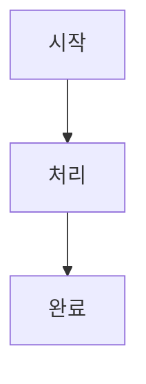
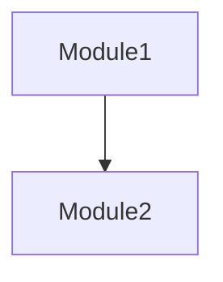

# Planner - Integrated Work Planning Expert

## Usage

```
/planner <work-description> [--edit] [--review] [--parallelable]
```

### Options

- **--edit**: Edit existing `./ai-todolist.md`
- **--review**: Get review from plan-reviewer agent after creation
- **--parallelable**: Mark independent tasks for parallel execution (use conservatively)
  - Requirements: zero dependencies, different files, no shared state, independently testable
  - When uncertain, default to sequential

## What this command does

Analyzes requirements → gathers implementation info → generates actionable plan → saves to `./ai-todolist.md`

## Core Principles

- **Specific Direction**: Concrete guidelines workers can directly follow
- **Code Citations**: Include relevant code and patterns found
- **Balanced Detail**: Skip obvious explanations
- **Practical Focus**: Implementation over theory
- **Markdown Format**: Human-readable, no escape overhead, native code block support

---

## Phase 1: Analysis & Information Gathering

### 1.1 Option Processing
- `--edit`: Read existing `./ai-todolist.md` first
- `--review`: Mark for review after creation
- Default: New plan creation

### 1.2 Requirements Analysis
1. **Goals**: Clarify objectives, distinguish functional/non-functional, define success criteria
2. **Scope**: Include/exclude boundaries, priorities, phased implementation

### 1.3 Project Documentation Discovery & Selection
1. **Discover docs** (list only, don't read all):
   ```bash
   find docs/ -type f -name "*.md" 2>/dev/null | head -20
   ls -la *.md 2>/dev/null | grep -E "(README|CONTRIBUTING|CONVENTION)"
   ```

2. **Categorize & Select** - Read only task-relevant docs:
   | 카테고리 | 예시 파일 | 언제 참고 |
   |---------|----------|----------|
   | 코딩 컨벤션 | `conventions.md`, `CONTRIBUTING.md` | 새 코드 작성 시 |
   | 아키텍처 | `architecture.md`, `design.md` | 새 모듈 추가 시 |
   | API 가이드 | `api.md`, `endpoints.md` | API 작업 시만 |
   | 설정/환경 | `setup.md`, `development.md` | 환경 설정 시만 |
   | 도메인 | `domain.md`, `glossary.md` | 도메인 이해 필요 시 |

   ✅ 작업 관련 문서만 읽기 / ❌ 모든 문서 무조건 읽지 않기

### 1.4 Codebase Analysis
1. **Find Related Patterns**: Similar functionality, reusable patterns, related modules
2. **Implementation Context**: Integration points, dependencies
3. **Git Conventions**: `git log -10 --oneline` → commit patterns, naming conventions

### 1.5 Smart Code Exploration
- Semantic: `ck --sem "[concept]"` / Hybrid: `ck --hybrid "[keyword]"` / Exact: `Grep`
- Cross-reference patterns with `docs/`

---

## Phase 2: Plan Creation (Markdown Format)

### 2.1 Markdown Template Structure

```markdown
---
original_request: "사용자 최초 요청 그대로"
goals:
  - 목표 1
  - 목표 2
background: "작업 배경 설명"
execution_started: false
all_goals_accomplished: false
parallel_requested: false
current_task: null
created_at: 2025-12-08T10:00:00Z
updated_at: 2025-12-08T10:00:00Z
---

# Work Plan: [작업 제목]

## Additional Requests
- 추가 요청 1
- 추가 요청 2

---

## Context

### Prerequisites
- 사전 지식 1
- 사전 지식 2

### File Structure
작업에 영향받는 파일들과 역할 설명

### Reference Files

#### `src/example.py`
- **Role**: 파일 역할
- **Focus**: 참고할 부분

```python
class Example:
    def method(self):
        pass
```

### Conventions

| 항목 | 내용 |
|------|------|
| Commit Style | `feat: description` |
| Code Patterns | 패턴 1, 패턴 2 |

**Referenced Docs:**
- `docs/api.md` - API 패턴 확인 (REST 규칙)

**Skipped Docs:** `docs/unrelated.md`

---

## Implementation

### PRD Flow


### Structure


### Details
구현 세부사항 및 주의사항

---

## Tasks

### Task 1: User 모델 수정 및 테스트
**Status:** `pending` | **Parallel Group:** -

#### Context
- **Current State**: 현재 상태
- **Target State**: 목표 상태

#### Reference Code
```python
# 참고할 코드 스니펫
def existing_pattern():
    pass
```

#### Subtasks
- [ ] **1.1** [implement] UserModel에 field 추가 → `src/models/user.py`
- [ ] **1.2** [test] 테스트 작성 → `tests/test_user.py`
- [ ] **1.3** [verify] pytest 실행: `pytest -xvs tests/test_user.py`
- [ ] **1.4** [lint] 린트 체크: `ruff check src/models/user.py`
- [ ] **1.5** [commit] 커밋

#### Acceptance Criteria
- [ ] **1.ac.1** 코드가 컨벤션대로 작성됨 (검증: 기존 코드베이스 스타일과 비교)
- [ ] **1.ac.2** 테스트 통과 (검증: pytest 실행 결과 확인)
- [ ] **1.ac.3** 커밋 완료 (검증: git log 확인)

---

### Task 2: 병렬 작업 예시
**Status:** `pending` | **Parallel Group:** 2

> ℹ️ 기능 3과 완전히 독립적, 다른 파일 수정, 의존성 없음

#### Subtasks
- [ ] ...

#### Acceptance Criteria
- [ ] ...

---

## Final Checklist

- [ ] **1.** 기능 동작 검증 (검증: 직접 기능 호출하여 테스트)
- [ ] **2.** 컨벤션 준수 확인 (검증: 프로젝트 컨벤션 문서와 비교)
- [ ] **3.** 기존 기능 영향 없음 확인 (검증: 관련 테스트 전체 실행)
```

### 2.2 Markdown Benefits (vs JSON)

| 항목 | JSON | Markdown |
|------|------|----------|
| Escape 필요 | `\"`, `\\`, `\n` 필수 | 불필요 |
| 코드 블록 | 문자열로 escape | 네이티브 지원 |
| 가독성 | 구조적 but 복잡 | 자연스러움 |
| 체크박스 | boolean 필드 | `- [ ]` / `- [x]` |
| 메타데이터 | JSON 객체 | YAML frontmatter |
| 토큰 효율 | 오버헤드 큼 | 간결함 |

### 2.3 Plan Creation Strategy

1. **Adaptive Detail Level**
   - Small: WHAT + WHERE
   - Medium: + HOW with examples
   - Large: + WHY and full context

2. **TodoWrite**: Each todo = one verifiable action

3. **Success Criteria**: Clear DONE definition, exact verify commands, no ambiguous terms

4. **Parallel Tasks** (with `--parallelable`):
   - Only when certain tasks are independent (different files, zero dependencies)
   - Set same `Parallel Group` number for parallel tasks
   - When uncertain → sequential (set `Parallel Group: -`)

---

## Phase 3: Option Processing

### --review Option
Always send as "This is my first draft" to trigger strict review:

```python
Task(
    subagent_type="plan-reviewer",
    description="Review work plan",
    prompt="""
    Please review the created work plan. This is my first draft, and may have lots of mistakes - I have a super-problematic ADHD, so there are tons of mistakes and missing points, so I want you to catch them all.

    Plan location: @./ai-todolist.md

    Please evaluate from these perspectives:
    1. Clarity and achievability of goals
    2. Logical order of implementation steps
    3. Appropriateness of technical approach
    4. Risk identification and mitigation
    5. Sufficiency of validation methods
    6. Markdown format validity (frontmatter, checkboxes, code blocks)

    If improvements are needed, please point them out specifically.
    If the plan is sufficiently good, please say "OKAY".
    """
)
```

**Feedback Loop**:
- "OKAY" → Complete
- Improvements requested → Modify and re-review
- **Always say "first draft"** in every iteration (never "I reflected feedback...")

### --edit Option
1. `Read("./ai-todolist.md")`
2. Identify sections needing changes
3. Update only necessary parts, maintain structure
4. Preserve YAML frontmatter format

---

## Phase 4: Final Output

1. **Save Markdown**: Write to `./ai-todolist.md`
2. **Validate**: Ensure frontmatter is valid YAML, checkboxes are properly formatted
3. **TodoWrite**: Add each implementation step
4. **Report**: Confirm save location, step count, implementation scope

---

## Quality Checklist

### Plan Quality
- [ ] Goals clear and measurable?
- [ ] Steps in logical order?
- [ ] Clear completion criteria per step?
- [ ] Matches existing code patterns?
- [ ] Specific test/validation methods?
- [ ] Exception handling plans?

### Markdown Quality
- [ ] Valid YAML frontmatter?
- [ ] All checkboxes properly formatted (`- [ ]`)?
- [ ] Code blocks have language hints?
- [ ] Headers properly nested (h1 > h2 > h3)?
- [ ] Tables aligned?

### Information Fidelity
- [ ] File paths accurate?
- [ ] Reference code from actual project?
- [ ] Commit conventions reflected?
- [ ] Tech stack identified?
- [ ] Project docs discovered?
- [ ] Only task-relevant docs read?

## Core Constraints

1. **Docs Discovery First**: List available docs → selectively read task-relevant ones only
2. **Information First**: Sufficient analysis before planning
3. **Practical Focus**: Implementation over theory
4. **Incremental**: Iterative improvement over one-time perfection
5. **Verifiable**: All steps must be testable
6. **Maintain Patterns**: Keep project's existing style and documented conventions
7. **Markdown Format**: Single file, human-readable, no escape overhead

## Work Completion Message

**After plan creation, ALWAYS output the following message format:**

```
📋 계획이 완료되었습니다!

📁 파일 위치: ./ai-todolist.md
📊 총 {N}개의 태스크, {M}개의 서브태스크

다음 단계:
1. 계획 확인: 위 파일을 열어 계획 내용을 검토하세요
2. 수정 필요 시: `/planner --edit` 또는 직접 파일 수정
3. 실행 준비 완료 시: `/execute ./ai-todolist.md` 으로 실행

⚠️ 실행 전 계획을 꼭 확인해주세요!
```

**Key Points:**
- DO NOT use ExitPlanMode or any plan acceptance UI
- DO NOT wait for user approval through Claude's plan mode
- Simply save the file and provide clear next-step instructions
- Let the user manually review and decide the next action
- The user has full control over when to execute

Provide:
- Save location: `./ai-todolist.md`
- Total task/subtask count
- Implementation scope summary
- Markdown validation status: ✅ Valid
- Clear next-step instructions (review → modify → execute)
